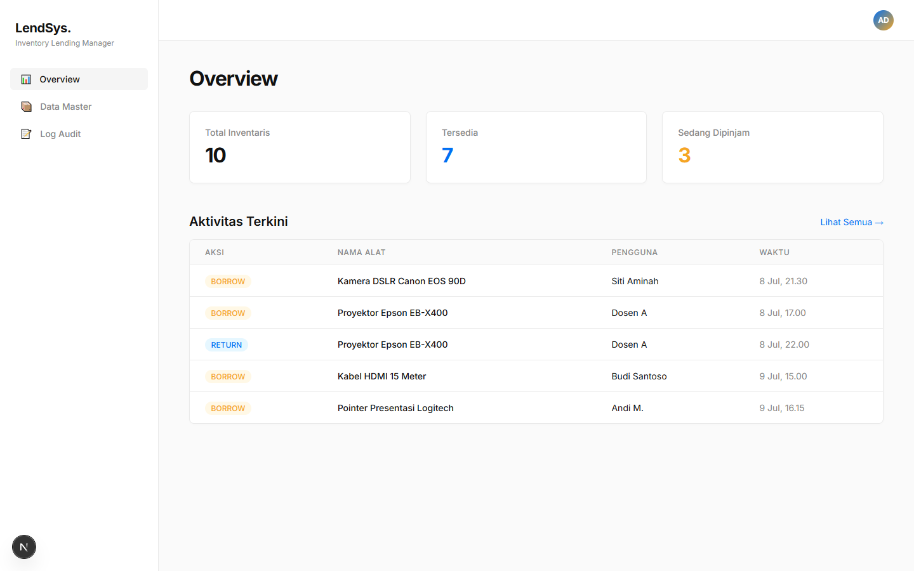
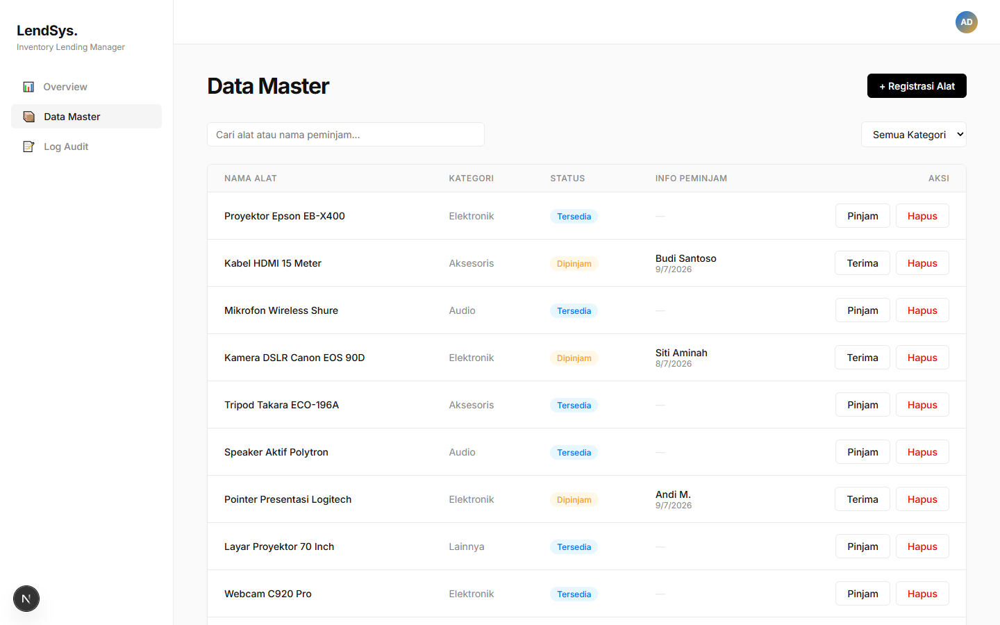
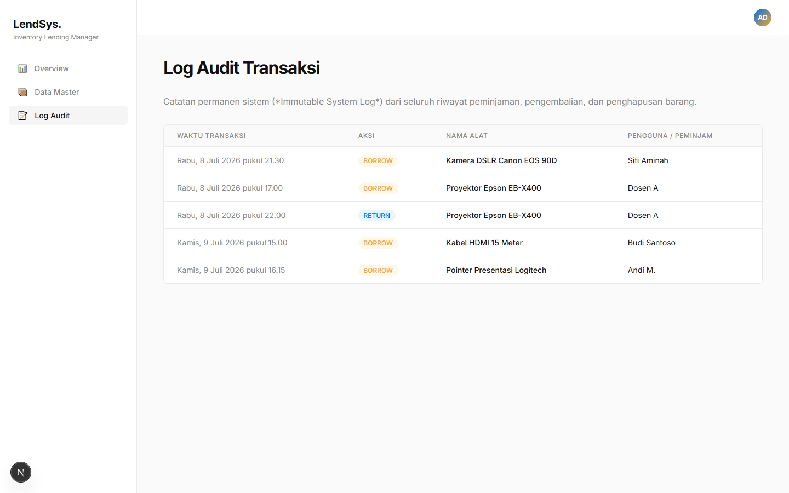

<div align="center">
  <h1>🚀 LendSys - Enterprise Inventory Lending System</h1>
  <p><strong>Ujian Akhir Semester (UAS) Pemrograman Berbasis Web</strong></p>
  <p>Sistem Informasi Manajemen Peminjaman Alat/Barang berarsitektur Multi-Page berbasis Next.js dengan antarmuka UI/UX Enterprise SaaS.</p>
</div>

<br />

## 👥 Informasi Pengembang
- **Anggota Tim**: Kelompok 10
- **Nama**: FADILLAH
- **Kelas**: Kelas D (PBW-IF-VD)
- **Mata Kuliah**: Pemrograman Berbasis Web

---

## 📖 Deskripsi Proyek
**LendSys** adalah aplikasi web generasi modern (*Next-Gen Web App*) yang dirancang khusus untuk mengelola tata usaha inventaris dan peminjaman alat di sebuah instansi atau kampus. 

Tidak seperti aplikasi manajemen tugas (To-Do List) konvensional, proyek ini telah di-upgrade secara arsitektural menjadi sebuah produk berstandar **SaaS (Software as a Service)** kelas berat. Menghadirkan desain UI Ultra-Premium yang minimalis, navigasi multi-halaman (*Multi-Page App*), dan sistem Audit Log permanen, menjadikannya solusi Enterprise *ready-to-use*.

---

## 📸 Cuplikan Layar (Screenshots)

### 1. Dashboard Overview (Pusat Analitik & Aktivitas)
Tampilan pusat kendali dengan perhitungan metrik langsung (*Live Metrics*) dan pantauan aktivitas transaksi terkini.


### 2. Data Master (Sistem Kelola Inventaris)
Tabel inventaris komprehensif dengan fitur Filter Kategori, Pencarian Instan, serta fungsionalitas CRUD tingkat lanjut (Modal Tambah & Modal Peminjaman).


### 3. Log Audit Transaksi (Catatan Permanen)
Sistem pembukuan otomatis tak terhapuskan (*Immutable Log*) yang merekam jejak waktu, jam, tanggal, dan nama pengguna dari setiap mutasi barang.


---

## ⚡ Fitur Utama (Capabilities)

### 🎨 1. Enterprise-Grade UI/UX
- **Vercel/Linear Design Language**: Tampilan monokromatik super bersih, margin presisi, *border* 1px, dan font *Inter*. Bebas dari palet warna norak AI.
- **Skeleton Loading Screen**: Menggantikan putaran *loading* tradisional dengan *pulse-block* skeleton layaknya aplikasi raksasa (Facebook/YouTube).
- **Toast Notifications System**: Notifikasi pop-up dinamis dengan animasi melayang di sudut layar untuk setiap notifikasi sukses/gagal.
- **Glassmorphism Modals**: Jendela dialog input dengan *backdrop blur* premium.

### ⚙️ 2. Core Functionalities (RESTful API CRUD)
- **C**reate: Registrasi alat baru melalui modal *form* ke dalam sistem Data Master.
- **R**ead: Tabel *dashboard* komprehensif dan Log Audit yang membaca data *array* kompleks dari backend.
- **U**pdate: Logika dinamis untuk proses **Pinjam** (mengisi data peminjam & *timestamp*) dan **Terima** (mereset alat menjadi *Tersedia*).
- **D**elete: Penghapusan aset permanen dari direktori dengan *prompt* konfirmasi keamanan.

### 🔍 3. Advanced Data Management
- **Instant Search**: Pencarian pintar lintas kolom (nama alat / nama peminjam) secara *Real-Time* (Tanpa perlu tekan *Enter* atau muat ulang).
- **Category Filtering**: Penyaringan data cerdas menggunakan *dropdown* (Elektronik, Audio, Aksesoris, dll).
- **Immutable Audit Logging**: Setiap operasi *Borrow*, *Return*, dan *Delete* yang dieksekusi akan ditangkap secara paksa oleh sistem *backend API* dan dikunci dalam buku log absolut (History Log) beserta konversi Waktu Universal Terkoordinasi (UTC/ISO Date).

---

## 🛠️ Stack Teknologi (Tech Stack)
Aplikasi ini di-build menggunakan ekosistem *JavaScript/React* paling modern saat ini:
- **Framework**: [Next.js (App Router)](https://nextjs.org/)
- **Frontend Library**: React.js
- **Styling**: Vanilla CSS3 (Custom Enterprise Design System)
- **Backend/API**: Next.js Serverless Route Handlers (`app/api/*`)
- **State Management**: React Hooks (`useState`, `useEffect`, `useMemo`)

---

## 📁 Struktur Arsitektur Halaman
Aplikasi terdiri dari *3 Route Utama*:
1. `/` (Dashboard): `page.js` untuk Ikhtisar Analitik.
2. `/inventory` (Data Master): `inventory/page.js` untuk fungsionalitas CRUD Tabel Cerdas.
3. `/reports` (Laporan Audit): `reports/page.js` untuk riwayat log interaksi (*Immutable*).

Semua halaman dibungkus oleh desain **Global Layout** presisi di dalam `layout.js` yang memuat *Sidebar Navigation* dan *Top Header*.

---

## 🚀 Panduan Instalasi Lokal (Local Deployment)

Pastikan Anda telah memiliki [Node.js](https://nodejs.org/en) terpasang di komputer Anda.

1. Buka *Command Prompt / Terminal* pilihan Anda.
2. Navigasikan (CD) ke direktori *Root* proyek:
   ```bash
   cd PBW-IF-VD/Kelompok_10_FADILLAH
   ```
3. Unduh semua paket dependensi yang dibutuhkan:
   ```bash
   npm install
   ```
4. Jalankan *Next.js Development Server*:
   ```bash
   npm run dev
   ```
5. Akses aplikasi Anda melalui browser:
   **[http://localhost:3000](http://localhost:3000)**

---

## 🌐 Panduan Deployment ke Vercel (Production)

Sistem ini memiliki persentase keberhasilan rilis `100% Build Success` (tervalidasi). Sangat direkomendasikan untuk men-deploy (*hosting*) proyek ini menggunakan **Vercel** karena integrasinya yang seketika (*Native Next.js Hosting*):

1. Unggah (*Push*) repository proyek ini sepenuhnya ke akun **GitHub** Anda.
2. Buka situs [Vercel](https://vercel.com/) dan lakukan login menggunakan akun GitHub tersebut.
3. Klik tombol **`Add New...`** -> Pilih **`Project`**.
4. Import *Repository GitHub* Anda (Misal: `UAS-PBW`).
5. **(Langkah Krusial)** Pada opsi *Root Directory*, tekan tombol *Edit* dan arahkan jalurnya ke: `PBW-IF-VD/Kelompok_10_FADILLAH`.
6. Klik tombol **Deploy** dan biarkan Vercel mengeksekusi proses kompilasinya.
7. 🎉 Proyek UAS *LendSys* Anda kini sudah online, *Live*, dan siap dipresentasikan di hadapan dosen!
